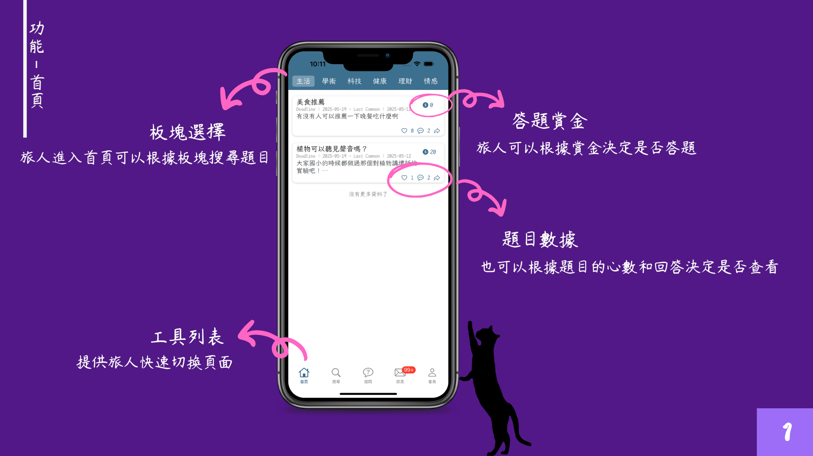
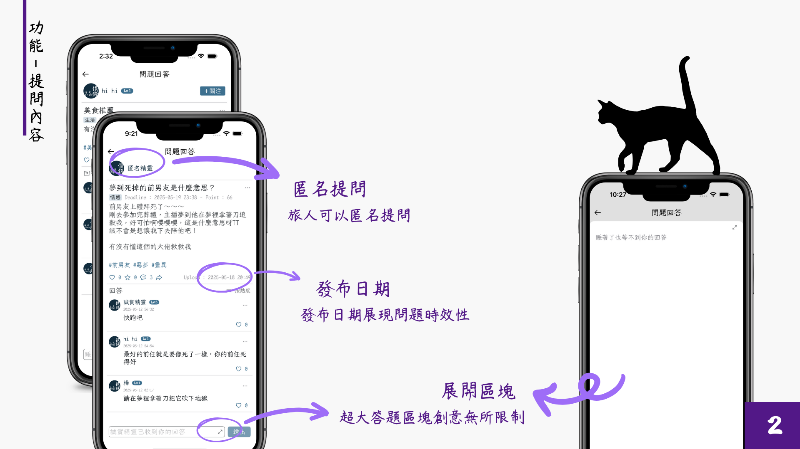
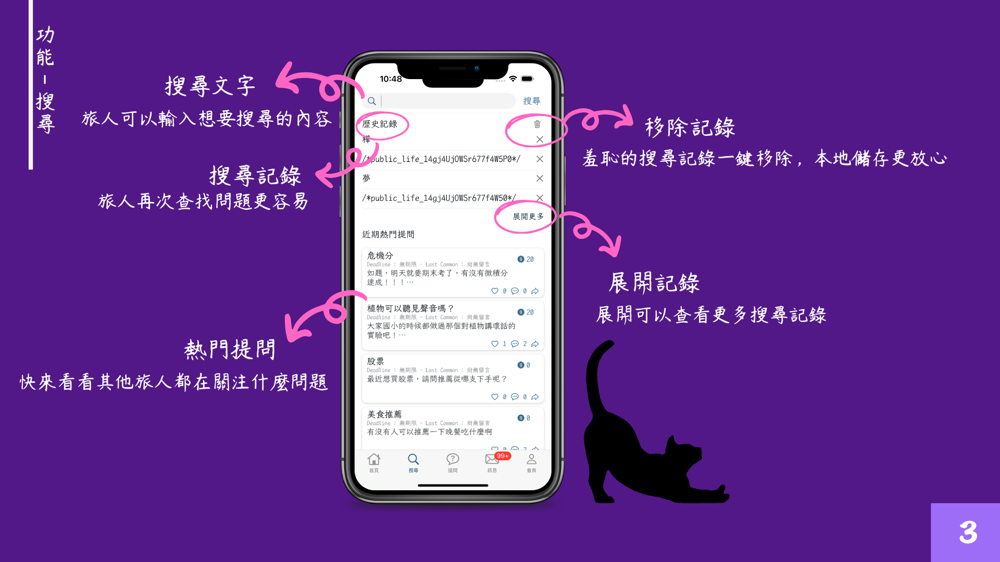
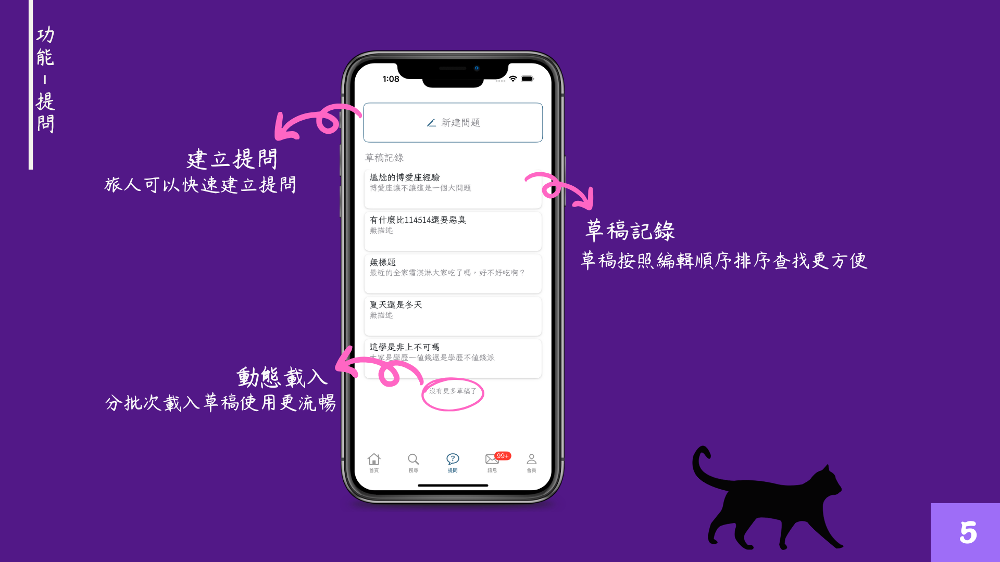
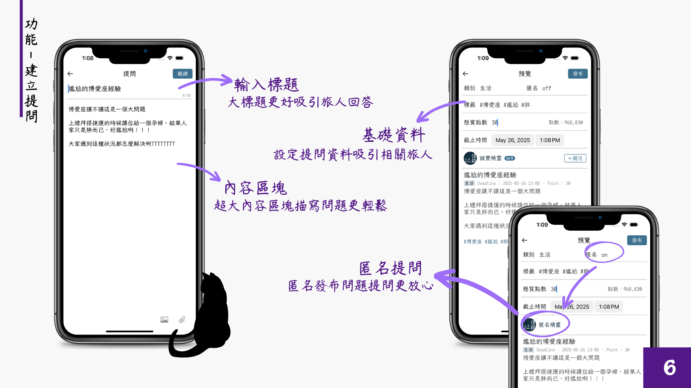
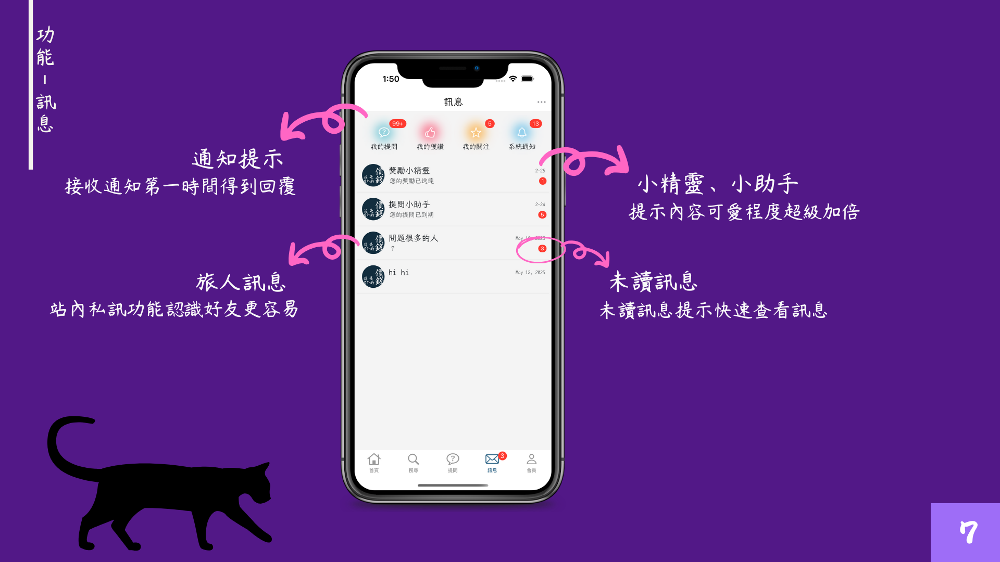
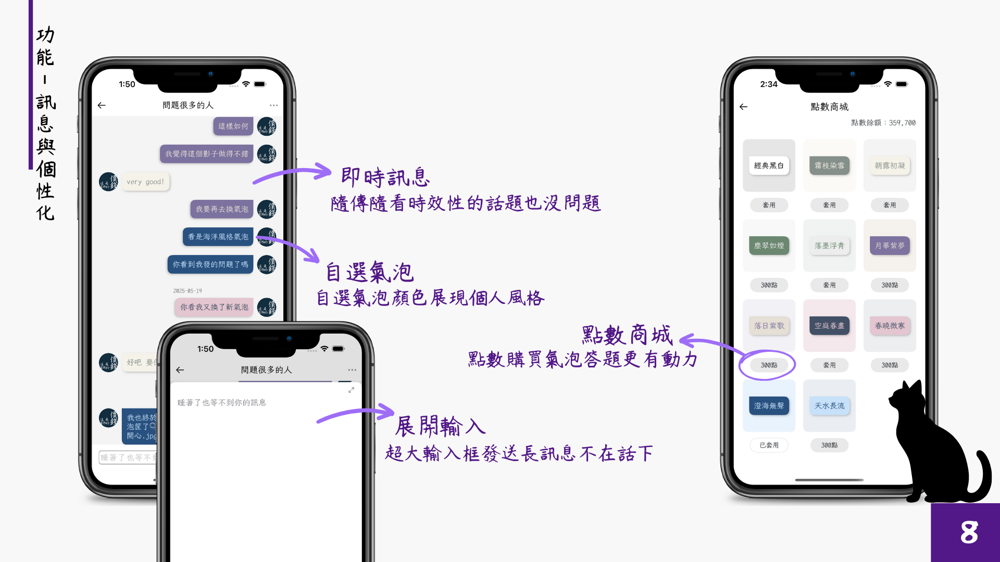
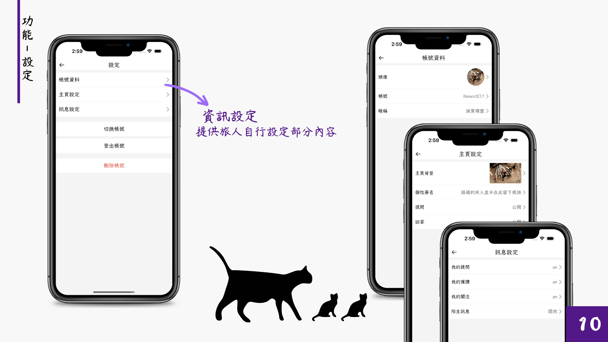
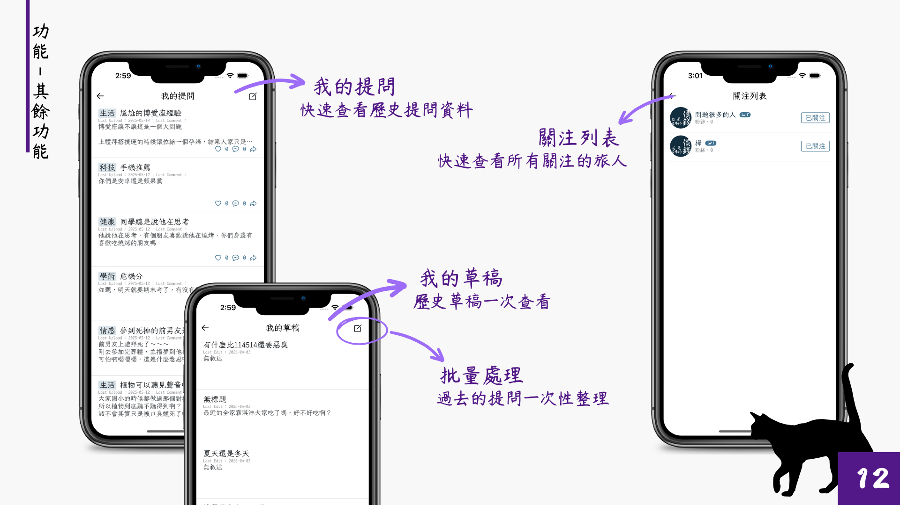

# Knowledge Q&A iOS Project

Duration **2025-04 – 2025-06**

iOS Q&A app built with SwiftUI and Firebase.  

- **Usage reference:** Modeled after Baidu Knowledge and Yahoo Knowledge for Q&A interactions  
- **UI reference:** Interface inspired by multiple popular mobile apps for usability and familiarity  

This is a team project:  
- **Frontend (me):** Design pages and handle navigation between pages  
- **Backend (teammate):** Integrate Firebase for Q&A data storage and user authentication

## Features

*The following images are exported from the original project presentation and illustrate the feature design and user flow.*

## Tech Stack

- SwiftUI
- Firebase
